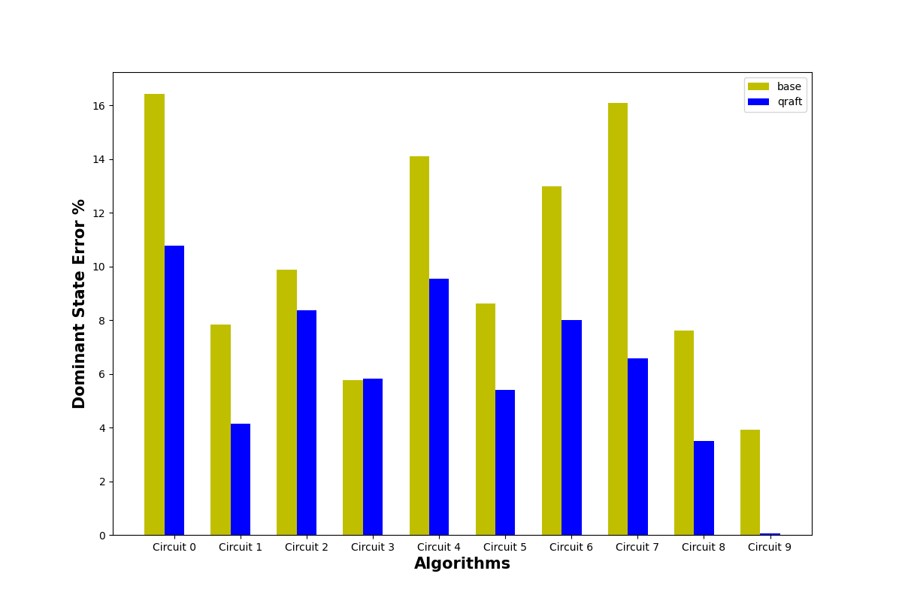

# Qraft

Python implementation of [Tirthak Patel and Devesh Tiwari. 2021. Qraft: reverse your Quantum circuit and know the correct program output. In Proceedings of the 26th ACM International Conference on Architectural Support for Programming Languages and Operating Systems (ASPLOS '21). Association for Computing Machinery, New York, NY, USA, 443–455.](https://par.nsf.gov/servlets/purl/10309262)

## Abstract:

Current Noisy Intermediate-Scale Quantum (NISQ) computers are useful in developing the quantum computing stack, test quantum algorithms, and establish the feasibility of quantum computing. However, different statistically significant errors permeate NISQ computers. To reduce the effect of these errors, recent research has focused on effective mapping of a quantum algorithm to a quantum computer in an error-and-constraints-aware manner. We propose the first work, QRAFT, to leverage the reversibility property of quantum algorithms to considerably reduce the error beyond the reduction achieved by effective circuit mapping.

## Repo structure:
- data_generation
    - data_gen.py: generates circuits used to train the model and saves them in a csv file
    - circuit.py: defines the CircuitGenerator and CircuitSimulator classes
    - states.py: defines the State class and some functions useful to simulate the states
    - benchmarking_error: used to benchmark the errors produced by Qraft model against a baseline and produce visualizations
    - benchmarking_empirical_cdf: computes and plots the empirical cdf of the errors
- qraft
    - training.py: trains a Random Forest Regressor (sklearn) based on the circuits generated precedently

## Results:
The result are summarized in the following plots:

